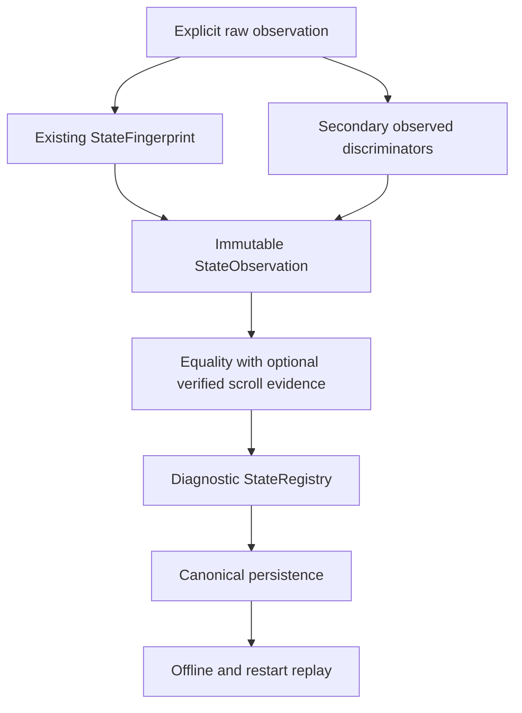

# Phase 2 — State Model Closure

2026-10-05 · branch `feature/phase2-state-model` · baseline `4c829536503503a1d963ff5144cfd6bed576a84f`.

## 1. Executive Summary

**PHASE2_PASS_WITH_LIMITATIONS. READY_FOR_PHASE3=YES.**

2A foundation을 보존하면서 2B equality → Gate → 2C Registry/persistence → Gate → 2D replay 순서로 구현·검증했다. 최종 보정 후 앞 단계 계약도 다시 확인했다. Fingerprint hash와 logical state ID를 분리하고, coarse collision과 불충분한 관찰은 unresolved로 보존한다.

실단말 root 재진입, 실제 focus churn, scroll/revisit와 별도 process replay에서 예상 밖 state 증가나 unsafe merge는 없었다. 전체 Python **2850 passed / 0 failed / 0 errors / 1 skipped**. Helper/APK 변경이 없어 재빌드하지 않았다. Production runtime/config 변경, Full32, Phase 3 구현, commit/push/merge는 없다.

## 2. Phase 2A Summary

[기존 2A 보고서](phase2a-state-fingerprint-contract.md)의 다섯 파일은 시작 시 SHA-256과 최종 값이 모두 일치한다. 기존 Home/Devices/Life 각 3회, 실제 focus 이동, Home scroll과 17 raw artifacts를 재사용했다. Root core 구분, focus-only 안정성, scroll core 유지/viewport 변경은 유지된다. JSONL **17/17 byte identical**을 다시 확인했다.

Core가 coarse하고 ID-bearing body label이 빠질 수 있으며 XML은 partial observation이다. Overlay absence도 확정하지 못한다. Equality sidecar는 필요한 secondary evidence를 추가하면서 이 제한을 보존한다.

## 3. Phase 2B Identity/Equality

[2B 보고서](phase2b-state-identity-equality.md). Gate: `output/phase2_state_model_20261005/phase2b_gate.json`.

`StateObservation`은 기존 fingerprint + normalized secondary labels/semantic values + coverage를 묶은 immutable sidecar다. `StateEqualityResult`는 SAME / DIFFERENT / AMBIGUOUS, base/logical/viewport/overlay relation, reasons, component matches, confidence와 references를 반환한다. `StateIdentity`는 Registry가 부여하는 persistent logical ID다.

원래 Gate는 신규 48 tests, 전체 **2773 passed / 0 failed / 1 skipped**, 실단말 필수 비교 12/12 PASS였다. 최종 2B tests **55 passed**, 전체 **2850 passed / 0 failed / 1 skipped**로 재검증했다. Root/semantic/overlay 구분, dynamic normalization, ordering, reviewed ko/en aliases, coarse collision, unknown/partial-full mismatch와 continuity validation을 보호한다.

```ini
PHASE2B_VERDICT=PASS_WITH_LIMITATIONS
EQUALITY_COLLISION_BLOCKER_COUNT=0
READY_FOR_PHASE2C=YES
```

## 4. Phase 2C Registry/Persistence

[2C 보고서](phase2c-state-registry-persistence.md). Gate: `output/phase2_state_model_20261005/phase2c_gate.json`.

`StateRegistry.observe()`는 비교·해결·기록만 수행한다. CREATED / REUSED / UNRESOLVED를 반환하며 미해결 관찰에는 null state ID를 남긴다. ID는 namespace 안에서 순차 할당한 뒤 저장한다. Fingerprint hash를 state_id로 쓰지 않는다.

원래 Gate는 신규 33 tests, 전체 **2806 passed / 0 failed / 1 skipped**였다. 최종 Registry tests **34 passed**. 실단말 18 observations를 3 states로 유지했고 Home scroll은 같은 state의 viewport 2개로 저장했다. Popup unknown context 1건은 unresolved다. Byte-equivalent save/load와 restart reuse를 확인했다.

```ini
PHASE2C_VERDICT=PASS_WITH_LIMITATIONS
REGISTRY_STATE_COUNT=3
UNSAFE_MERGE_COUNT=0
PERSISTENCE_ROUNDTRIP=BYTE_IDENTICAL
READY_FOR_PHASE2D=YES
```

## 5. Phase 2D Replay/Stability

기존 모델을 결합하는 offline replay module/CLI, reviewed fixture corpus와 테스트를 추가했다. 2D tests **36 passed**. Wrong equality/group oracle를 넣으면 FAIL이 되는 테스트도 포함한다.

Curated 21 datasets의 42 cases와 실제 artifact 98 cases를 replay했다. 실단말에는 저장된 2C Registry를 로드하고 root 순서를 바꿔 새 관찰 28건을 추가했다. 기존 3 IDs 유지, 새 state 0, 필수 equality 비교 23/23 PASS다.

Life 재진입 smoke는 두 번 실패했고 원문/관찰을 보존했다. 원인은 `map_area` 위치 확인 age `59분 전 → 1시간 전 → 지금`의 secondary label 차이였다. 해당 필드만 비교 시 정규화하고 대표 선택에도 적용했다. Device name, 실제 상태 문구, 다른 ID는 보존한다. Saved sidecar/fingerprint bytes는 변경하지 않았다. Ko/en, 복합 시간, 다른 이름/ID/context 보호 테스트와 전체 regression을 다시 실행했다. 최종 smoke는 `phase2d_device_run3/`다.

```ini
PHASE2D_VERDICT=PASS_WITH_LIMITATIONS
READY_FOR_PHASE3=YES
```

## 6. State Model Architecture



모든 결과는 diagnostic foundation에 머문다. 기존 production traversal에 결과를 반환하는 consumer는 추가하지 않았다. State/Action Graph, DFS/BFS, Auto Discovery와 Safe Action Selector도 구현하지 않았다.

## 7. Fingerprint Contract

2A schema, core/viewport/overlay hashes, relative32 geometry와 typed dynamic normalization을 유지했다. Focus/transient 또는 node input ordering 차이는 logical split의 근거가 아니다.

같은 source의 canonical StateFingerprint/StateObservation 재구축을 확인했다. Timestamp/scenario/step을 포함하는 기존 JSONL record envelope도 **81/81 byte identical**이었다. 2A는 raw에서 sidecar를 생성하고, 2B/2C/2D의 saved sidecar **64/64**는 raw 재구축과 일치했다.

Fingerprint-only replay는 원 fingerprint를 유지하지만 secondary labels를 추측하지 않는다. Equality 관찰 coverage를 UNOBSERVED로 설정해 state create/reuse를 막는다. 이는 원 XML이 비어 있었다는 뜻이 아니다.

## 8. Equality Contract

| Dimension | 분류 / 동작 |
|---|---|
| Known package/activity/navigation/selected tab/partition | HARD_IDENTITY, 알려진 변경은 DIFFERENT |
| Missing/contradictory context, coverage mismatch | SAME을 인정하지 않고 AMBIGUOUS |
| Persistent marker structure, 명확한 의미 상태 변경 | HARD_IDENTITY |
| Body multiset/secondary labels | SOFT_IDENTITY, 동일하면 bounded SAME, 미확인 차이는 AMBIGUOUS |
| Viewport | VIEWPORT_ONLY, logical relation과 독립해서 기록 |
| Observed overlay | Interaction 분리, 확인 가능한 base relation 보존 |
| Focus/timestamp/step/raw digest/positional IDs | TRANSIENT |
| Locale/source/reasons/unknown evidence | DIAGNOSTIC_ONLY, reviewed aliases와 availability guard |

VerifiedScrollEvidence는 exact observation IDs, actual success, SCROLL_MOVED, 서로 다른 legacy signatures/normalized viewport와 known vertical axis를 요구한다. ACK만으로 인정하지 않는다. Unlinked viewport 차이는 coarse core가 같아도 SAME으로 만들지 않는다.

Exact partial observations의 SAME은 관찰 범위의 relation이다. Whole-screen equality, complete coverage나 overlay absence를 증명하지 않는다. Known semantic flag/value 변화는 DIFFERENT, 불명확한 duplicate geometry correspondence는 AMBIGUOUS다. Locked/unlocked, connected/disconnected, enabled/disabled, checked/unchecked를 volatile temperature 등과 구분한다.

## 9. Registry Contract

Record에는 canonical observation reference, first/last seen, event count, unique observation references, representatives, viewport counts/references, scenario provenance와 확인 가능한 overlay base ID를 저장한다.

다른 ambiguous candidate 없이 SAME candidate가 하나면 reuse한다. 모든 후보가 DIFFERENT이고 입력이 usable이면 create한다. 나머지는 unresolved다. 한 state의 verified viewport membership은 유지하지만 SAME과 DIFFERENT가 섞이면 merge하지 않는다.

같은 observation 재입력은 event count를 늘리고 source document는 deduplicate한다. 이 수치는 physical visited/complete/explored authority가 아니다. 별도 fresh Registry의 할당 번호는 입력 순서에 따라 다를 수 있지만, 같은 저장 Registry의 persistent mapping은 유지된다.

## 10. Persistence Contract

`state-registry-v1`에 namespace, allocation sequence, model versions, states/observations/continuities/events와 checksum을 저장한다. Canonical UTF-8 JSON + LF, 같은 directory의 temporary file에 flush/fsync 후 atomic replace한다. 실패 시 기존 파일을 보존한다.

Load는 checksum/schema/structure, duplicate IDs/JSON keys, references와 event sequence를 검증한다. Events 재적용의 resolution 및 전체 known payload 일치를 요구한다. Outer checksum 재계산으로 손상된 count/reference를 숨길 수 없다. Unknown envelope fields는 비실행 metadata로 보존하고 unknown schema는 거부한다.

Fresh 2C replay가 재구축한 Registry는 원 저장 파일과 **byte identical**이었다. Curated 42 rows + artifacts 98 rows + 실제 저장 2C/2D Registry 28 rows = **168 mapping rows**를 별도 CLI process에서 load/replay했고 ID와 unresolved status가 일치했다. 재입력 시 CREATED가 REUSED로 바뀌는 것은 정상 동작이다.

## 11. Device Evidence

Serial `R3CX40QFDBP` / SM-F741N. 시작 시 battery 50%, USB 충전, Helper READY/TalkBack enabled를 확인했다. 첫 launcher scope 실패는 보존하고 package manager가 resolve한 기존 app component를 정상 실행했다. Reset/force-stop/APK install은 하지 않았다.

| Phase | Corpus / 필수 비교 | 결과 |
|---|---|---|
| 2A retained | 17 captures | 17/17 record byte replay PASS |
| 2B fresh | 18 captures / 12 comparisons | PASS, actual focus + down-scroll |
| 2C fresh | 18 captures / 12 comparisons | PASS, 3 states / Home viewports 2개 |
| 2D fresh | 28 captures / 23 comparisons | PASS, persistent IDs 3개 / new state 0 |

2D selected-root 관찰: Home 14, Devices 6, Life 7, unknown popup 1. 각 root 최소 3회를 충족했다. Home→Devices→Life→Home→Life→Devices→Home 재진입을 실행했다. Focus 4 moves 모두 capture에서 accessibilityFocused=true, state 증가 0이었다. Down-scroll/up-scroll revisit는 logical SAME / viewport DIFFERENT, 초기 top으로 돌아온 비교는 viewport equal=true였다.

2C baseline + 2D 저장 Registry:

| Root | Persistent ID suffix | Resolved events | Viewports | Semantic representatives |
|---|---|---:|---:|---:|
| Home | 00000001 | 25 | 2 | 2 |
| Devices | 00000002 | 9 | 1 | 1 |
| Life | 00000003 | 10 | 1 | 1 |

전체 events 46 = resolved 44 + unknown popup 2. 이번 2D 28건 중 unresolved는 popup 1건이다. Restart 재입력 count는 별도 파일에 저장해 baseline과 분리했다. 종료 상태는 Home top, popup dismissed다.

Authoritative folders: `output/phase2_state_model_20261005/phase2b_device_run2/`, `phase2c_device/`, `phase2d_device_run3/`. 두 번의 2D 실패 시도도 별도 폴더/log에 남겼다.

## 12. Replay Metrics

Primary acceptance pass 기준. Observation/event와 equality pair의 분모는 다르다. 같은 실제 화면이 여러 dataset에 있으므로 140 unique UI states를 뜻하지 않는다.

| Metric | Curated | Artifacts | Total |
|---|---:|---:|---:|
| TOTAL_REPLAY_CASES | 42 | 98 | 140 |
| FINGERPRINT_STABLE | 42/42 | 98/98 | 140/140 |
| EQUALITY_STABLE | 21/21 | 57/57 | 78/78 |
| REGISTRY_RESOLUTION_STABLE | 42/42 | 98/98 | 140/140 |
| STATE_COLLISIONS | 0 | 0 | 0 |
| UNSAFE_MERGES | 0 | 0 | 0 |
| UNEXPECTED_STATE_SPLITS | 0 | 0 | 0 |
| AMBIGUOUS_CASES | 8 | 20 | 28 |
| AMBIGUOUS_EQUALITY_PAIRS | 6 | 1 | 7 |
| UNEXPECTED_UNRESOLVED | 0 | 0 | 0 |
| FINGERPRINT_ONLY_CASES | 2 | 17 | 19 |

Artifact sources: 2A raw 17, 2B 18, 2C 18, 2D 28, 2A fingerprint-only 17. 2A 초기 Home은 bottom viewport이며 prepare-up transition 증거는 저장돼 있지 않다. Manifest는 top과 저장된 verified down-scroll을 먼저 등록하고 초기 bottom snapshot을 나중에 등록하는 명시적 replay 순서를 사용한다. 원 capture 순서의 prepare-up movement가 증명됐다고 주장하지 않는다.

Curated/artifact의 별도 process 재입력도 같은 metrics와 mapping을 유지했다. 실제 저장된 2C+2D Registry에 2D28건을 재입력한 process도 28/28 stable, states 3개였다.

```powershell
python -m tools.state_model_replay --manifest tests/state_model_data/replay_cases.json --registry-out output/phase2_state_model_20261005/curated_registries --report-out output/phase2_state_model_20261005/curated_replay.json
python -m tools.state_model_replay --manifest output/phase2_state_model_20261005/artifact_replay_manifest.json --registry-out output/phase2_state_model_20261005/artifact_registries --report-out output/phase2_state_model_20261005/artifact_replay.json
python -m tools.state_model_replay --manifest output/phase2_state_model_20261005/device_restart_manifest.json --registry-in output/phase2_state_model_20261005/phase2d_device_run3/state_registry.json --registry-out output/phase2_state_model_20261005/phase2d_process_restart_registry.json --report-out output/phase2_state_model_20261005/phase2d_process_restart.json
```

Separate process reports: `curated_replay_restart.json`, `artifact_replay_restart.json`, `phase2d_process_restart.json`. [Artifact audit](../../output/phase2_state_model_20261005/artifact_audit.json)에 byte checks와 mapping 일치를 기록했다.

## 13. Collision Analysis

같은 resource ID/class/bounds/root의 Settings subpage와 Details subpage fixture는 coarse core뿐 아니라 전체 2A hash가 같다. Secondary label 차이를 AMBIGUOUS로 남기고 Registry에서 unsafe merge/new를 하지 않는다. Connected/disconnected는 secondary semantic value로 DIFFERENT가 되며 persistent marker 구조가 다른 fixture도 DIFFERENT다.

실제 Home/Devices/Life는 별도 state, root collision 0이다. Focus 변경으로 state를 추가하지 않고 verified scroll viewports는 같은 state로 유지했다. Raw hash collision이 없다고 선언하지 않는다. Reviewed corpus의 collision blocker, unsafe merge, unexpected split은 0이다.

## 14. Ambiguous Cases

28 ambiguous registration cases:

- Curated 8: unlinked viewport, coarse collision, missing activity, partial/full·partial subset 차이와 fingerprint-only 정보 부족.
- Artifact 20: 2B/2C/2D popup 각 1 + secondary 없는 2A fingerprint-only 17.

Popup은 기존 detector가 overlay를 확정하지 못하고 selected context도 누락돼 unresolved다. 실단말 overlay detection 성공으로 보고하지 않는다. Dialog/popup/bottom-sheet/permission overlay의 interaction/base relation은 controlled fixtures로 검증했다. Expected AMBIGUOUS와 성공한 SAME은 구분한다.

## 15. Known Limitations

1. Observed/partial scope의 identity이며 whole-app equality나 terminal completeness의 증명이 아니다.
2. 실 popup의 overlay 분류/selected context는 미해결이다. Unresolved로 보존한다.
3. Bare fingerprint의 secondary labels를 복원할 수 없어 raw/sidecar 보존이 필요하다.
4. Unreviewed locale/label/subpage, unknown geometry와 증명되지 않은 viewport transition은 AMBIGUOUS가 늘 수 있다.
5. Cross-locale은 reviewed aliases 범위다. Global cross-registry IDs, durable navigation resume와 parallel writers는 미구현이다.
6. Persistent marker는 명시 관찰이 필요하다. Duplicate/recycled geometry의 physical object identity는 구현하지 않았다.
7. Event evidence가 크고 load 시 전체 events를 검증한다. 대규모 관찰의 performance/retention은 후속 설계가 필요하다.
8. 기존 xlsxwriter thumbnail test 1 skipped와 pytest cache permission warning이 남는다. Phase2 tests의 skip/failure는 0이다.

## 16. Production Isolation

Tracked unstaged/staged diff는 비어 있다. 기존 runtime, selection, termination, max_steps, navigation, Helper/APK를 변경하지 않았다. Fingerprint/equality/Registry를 기존 runtime에서 호출하는 consumer도 추가하지 않았다.

```ini
PRODUCTION_RUNTIME_CHANGED=NO
PRODUCTION_CONFIG_CHANGED=NO
HELPER_CHANGED=NO
PRODUCTION_CONFIG_SHA256=6dd5d8a191d21e4366ed2513627d97b37515a1e2ae9c2ed342b8d2317fecb964
PHASE2A_FIVE_FILE_HASH_CHECK=PASS
EXISTING_OUT_615_FILE_HASH_CHECK=PASS
```

기존 regression이 `out/s1/content_scope`에 snapshot 72개를 append했다. 기존615개 hash와 신규 파일 범위를 확인하고 이번 테스트가 생성한72개만 ignored `output/phase2_state_model_20261005/test_generated_out/`으로 archive했다. 이동 manifest/hash도 저장했다. 최종 `out/`의 파일 집합과 bytes는 시작 상태와 완전히 같으며 사용자 기존 변경은 보존됐다.

## 17. Performance Notes

Local diagnostic sample이며 production benchmark는 아니다. Home raw의 fingerprint+sidecar 구성20회: median **85.57 ms**, max **102.09 ms**. 3-state Registry reuse10회: median **98.80 ms**, max **114.14 ms**.

46 events Registry는 **5,676,877 bytes**, event 검증 포함 load **6.02 seconds**였다. 대표 관찰로 비교 중복을 줄이지만 event별 equality evidence와 observation 저장은 크기/load 비용에 영향을 준다. Hot traversal path에 대한 성능 승인은 아니다. Corpus 확대 전 retention, indexing, load budget과 memory 측정이 필요하다.

## 18. Phase 3 Preconditions

**READY_FOR_PHASE3=YES**는 State observation→Candidate Discovery→Action model→transition observation의 진단 integration을 시작할 기반이 있다는 뜻이다. Phase 3 구현은 이번 작업에 포함하지 않았다.

Integration은 raw/secondary evidence, coverage/version과 persistent namespace를 보존해야 한다. AMBIGUOUS를 activation 권한이나 visited credit로 바꾸지 않는다. Unknown overlay/context, unlinked viewport를 completeness와 혼동하지 않는다. Candidate/graph 경계와 대규모 관찰 성능·retention을 정의하고 후속 safety contract를 충족한 뒤에만 automatic activation을 검토한다.

## 19. Final Verdict

```ini
PHASE2_FINAL_VERDICT=PHASE2_PASS_WITH_LIMITATIONS
PHASE2A_VERDICT=PASS_WITH_LIMITATIONS
PHASE2B_VERDICT=PASS_WITH_LIMITATIONS
PHASE2C_VERDICT=PASS_WITH_LIMITATIONS
PHASE2D_VERDICT=PASS_WITH_LIMITATIONS
FINGERPRINT_COLLISION_BLOCKER_COUNT=0
STATE_COLLISION_COUNT=0
UNSAFE_MERGE_COUNT=0
UNEXPECTED_STATE_SPLIT_COUNT=0
AMBIGUOUS_REPLAY_COUNT=28
PYTHON_TEST_RESULT=2850 passed / 0 failed / 0 errors / 1 skipped
PRODUCTION_RUNTIME_CHANGED=NO
PRODUCTION_CONFIG_CHANGED=NO
HELPER_CHANGED=NO
ARTIFACT_AUDIT_RESULT=PASS
READY_FOR_PHASE3=YES
COMMITTED=NO
PUSHED=NO
MERGED=NO
```

관련tests: 2B55 + 2C34 + 2D36 = **125 passed**. 전체 Python은 **2851 collected**, 73.47초. Evidence: `final_regression2.log/xml`. 테스트 삭제/exclude/assertion 약화는 없다. 기존 `.test_tmp` 접근 제약 때문에 전체 suite는 sandbox 밖에서 실행했다.

`phase2b_gate.json`, `phase2c_gate.json`에 original gate와 final dependency revalidation을, `phase2d_gate.json`에 full regression/device/replay/isolation 결과를 기록했다.

## 20. Git State

| Phase | Worktree files |
|---|---|
| 2A retained | `tb_runner/state_fingerprint.py`, `tools/state_fingerprint_diagnostic.py`, `tests/test_state_fingerprint.py`, `tests/test_state_fingerprint_diagnostic.py`, `docs/design/phase2a-state-fingerprint-contract.md` |
| 2B | `tb_runner/state_observation.py`, `tb_runner/state_equality.py`, `tests/state_model_fixtures.py`, `tests/test_state_equality.py`, `docs/design/phase2b-state-identity-equality.md` |
| 2C | `tb_runner/state_registry.py`, `tests/test_state_registry.py`, `docs/design/phase2c-state-registry-persistence.md` |
| 2D / closure | `tb_runner/state_replay.py`, `tools/state_model_replay.py`, `tests/test_state_replay.py`, `tests/state_model_data/replay_cases.json`, `docs/design/phase2-state-model-closure.md` |
| Existing unrelated | `out/`, 기존615파일 전부 보존 |

Phase 파일18개는 모두 untracked다. 시작 시 2A5개를 유지하고 이번에13개 추가했다. Smoke/test/replay output은 repository policy에 따라 ignored `output/`에 저장했다. Staging하지 않아 일반 `git diff`에는 신규 파일이 나타나지 않는다.

```text
$ git branch --show-current
feature/phase2-state-model

$ git status --short
?? docs/design/phase2-state-model-closure.md
?? docs/design/phase2a-state-fingerprint-contract.md
?? docs/design/phase2b-state-identity-equality.md
?? docs/design/phase2c-state-registry-persistence.md
?? out/
?? tb_runner/state_equality.py
?? tb_runner/state_fingerprint.py
?? tb_runner/state_observation.py
?? tb_runner/state_registry.py
?? tb_runner/state_replay.py
?? tests/state_model_data/
?? tests/state_model_fixtures.py
?? tests/test_state_equality.py
?? tests/test_state_fingerprint.py
?? tests/test_state_fingerprint_diagnostic.py
?? tests/test_state_registry.py
?? tests/test_state_replay.py
?? tools/state_fingerprint_diagnostic.py
?? tools/state_model_replay.py

$ git diff --stat
(no output)

$ git diff --name-only
(no output)

```

`git ls-files --others --exclude-standard`: 총633 paths = Phase2 files18 + 기존 out files615. 전체 원문은 [final Git state](../../output/phase2_state_model_20261005/final_git_state.txt)에 기록했다.

```text
$ git rev-parse HEAD
4c829536503503a1d963ff5144cfd6bed576a84f
$ git diff --cached --stat
(no output)
```

