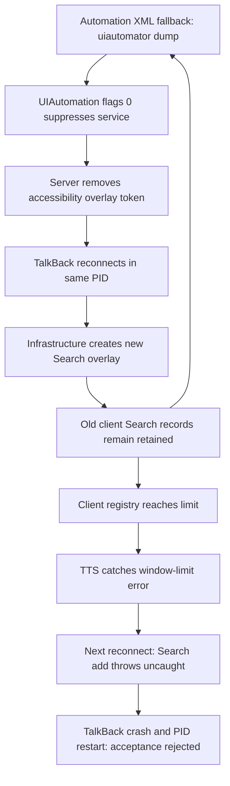

# Repeated TalkBack window-fatal RCA — 2026-10-09

## Decision

**FINAL_CLASSIFICATION=PROVEN_AUTOMATION_TRIGGER**

**PRIMARY_ROOT_CAUSE:** remaining automation `uiautomator dump` calls register UIAutomation with `flags=0x0`, suppress the accessibility service and remove its server overlay token. When TalkBack reconnects in the **same process**, its infrastructure creates another SearchScreenOverlay. Old Search views remain in the process-local WindowManagerGlobal registry. Repetition fills that registry; TTS first encounters the limit, and a subsequent service connection ends the process while constructing SearchScreenOverlay.

Confidence is **HIGH for the automation trigger and retained Search records**. The exact defective cleanup method inside the installed Samsung TalkBack/framework build is not available in these artifacts. This report does not assign that private implementation detail to Helper or claim an independent TalkBack defect without the automation interaction.

The Korean acceptance verdict remains **REJECT_NEW_BASELINE**. A PID restart remains a hard failure. No production change, device command, test run, Full32, English run, Phase 4 change, commit, or push was performed for this RCA.

## Source and evidence boundaries

- Analysis branch: `main`.
- `HEAD` and local `origin/main`: `b26c6432cc8edc8eacdc724ffb3e05a54e737451`, matching the requested baseline. No fetch was needed for this offline investigation.
- At entry, tracked changes were empty. Existing untracked rejection documents and `out/`, `s1/`, `tests/out/`, `tests/s1/` were preserved.
- New writes: this document and offline analysis artifacts in `qa_frontend_runs/window_fatal_rca_20261009/`. That artifact directory is ignored by Git. No tracked production files changed.
- Run 1: `qa_frontend_runs/full32_acceptance_20261008/batch_20261008_205140/device_SM-F741N_R3CX40QFDBP/`.
- Run 2: `qa_frontend_runs/batch_20261007_080753/device_SM-F741N_R3CX40QFDBP/`. Its repository provenance records head `df9e8b86df3df06c2d5dce1b107b2aec60b86094`, branch `docs/korean-full-run-acceptance-20261007`, dirty worktree. It predates the supplementary UIAutomator dump removal. It is not the later October 7 transport-rejection batch.

All times below are **KST, UTC+09:00**, including converted UTC monitor timestamps. `L` means original `logcat.txt` line; `R` means original `runner.log` line. TalkBack client overlay operations occur on PID=TID unless otherwise indicated. Some stored Korean runner/log labels contain encoding damage; ASCII event markers, numeric timestamps, PID and view hashes remain usable.

| Capture | Original logcat coverage | Lines | Important limitation |
|---|---|---:|---|
| Run 1 | October 8 20:51:43.076–23:44:00.885 | 4,980,449 | Ends before the process-ending stack; post-stop exit-info proves crash |
| Run 2 | October 7 08:07:55.208–11:56:45.503 | 6,920,888 | First PID already existed before capture; first incident lacks 10-minute prehistory |

`T0` in the pre-failure tables means the **first window-limit error**, caught by TTS. It is followed by the actual process-ending event. Keeping both timestamps avoids misclassifying the initial caught exception as an AndroidRuntime fatal.

| Incident | First limit error | Process-ending evidence | Scenario / step | PID change |
|---|---|---|---|---|
| Run 1 primary | 23:43:59.010, L4978550 | APP CRASH(EXCEPTION), exit-info 23:44:02.368 | `menu_main` entry; traversal not started | 21432 → 17467 |
| Run 2 primary | 08:09:04.555, L81517 | AndroidRuntime 08:09:09.094, L85185–85208; exit-info 08:09:09.096 | `home_main` entry/reset after global navigation; traversal not started | 18593 → 29833 |
| Run 2 additional, fully captured process | 11:32:15.776, L6178692 | AndroidRuntime 11:32:19.102, L6182535–6182558; exit-info 11:32:19.105 | `life_plant_care_plugin` entry/reset after Family Care; traversal not started | 29833 → 20060 |

Run 1 monitor detected the limit at 23:43:59.701 and stopped the batch at 23:43:59.890, with 22 terminal scenarios. Its pre-stop restart counter of zero is censored: exit-info and final PID show a crash/restart after stopping. The latest full-run rejection report records final PID 17467 at approximately 23:44:06.

## 1. Correct interpretation of the window diagnostics

`WindowManagerGlobal#addView` is a real operation. `addedView(299)`, `addedView(298)` … `addedView(250)` are **diagnostic enumeration of retained records**, not 50 newly issued adds. In each first-limit incident, 50 distinct SearchScreenOverlayLayout references are printed at indices 250–299. They include older hidden views (`G.E...`) and the latest view. These lines must not be included in add counts or interpreted as a millisecond overlay creation burst.

This corrects the earlier burst interpretation in `talkback-korean-full-run-rejection-20261008-final.md`; that original evidence/report remains preserved.

The fatal stack identifies **WindowManagerGlobal.addView**, a client-side collection. AOSP maintains `mViews`, `mRoots`, and `mParams` in this process-local singleton, and removes their entries through client cleanup. `dumpsys window windows` samples system_server WindowState records. The collections need not have equal counts. This distinction is supported by [AOSP WindowManagerGlobal](https://android.googlesource.com/platform/frameworks/base/+/refs/heads/main/core/java/android/view/WindowManagerGlobal.java). The device's limit and `addedView` formatting are observed vendor behavior; this report does not attribute the vendor cap to unmodified AOSP.

The missing records are predominantly **stale client Search overlays whose server tokens have already been removed**, rather than 300 live surfaced windows omitted by a display filter. Hidden Search is actually included in the server samples. No evidence requires another display or task to explain the mismatch.

## 2. Direct causal sequence in both runs

### Run 1: last dump before first error

| Time | PID / TID | Event | Original line |
|---|---|---|---:|
| 23:43:55.682 | adbd 4760 / 4760 | `uiautomator dump /sdcard/tb_runner_context_verify.xml` | 4973646 |
| 23:43:55.969 | system_server 2530 / 3646 | Register UiTestAutomationService, `flags=0x0` | 4973705 |
| 23:43:55.975 | system_server 2530 | Remove hidden Search Window; `WindowToken.removeAllWindowsIfPossible → removeWindowToken → AbstractAccessibilityServiceConnection.onDisplayRemoved/onRemoved`; no surface | 4973715 |
| 23:43:58.320 | TalkBack 21432 / 21432 | `System bound to service` | 4977061 |
| 23:43:58.343 | TalkBack 21432 / 21432 | True Search add, new `{36e9fb4}`, `createUIElements → constructor` | 4977248 |
| 23:43:58.354 | TalkBack 21432 / 21432 | Search `setView`, same identity | 4977339 |
| 23:43:59.001–.010 | TalkBack 21432 / 21432 | Retained Search index 299 `{36e9fb4}` through index 250 `{81d3f06}` | 4978176–4978542 |
| 23:43:59.010 | TalkBack 21432 / 21432 | TTS caught IllegalStateException, `window count is over max!!` | 4978550 |
| 23:43:59.780 | adbd | Another context XML dump already requested near monitor stop | 4978890 |
| 23:44:00.091 / .098 | system_server | Register flags 0 / remove current Search server token again | 4978969 / 4978984 |
| 23:44:02.368 | PID 21432 | APP CRASH(EXCEPTION), post-stop `talkback_exit_info_end.txt` | exit-info #0 |

The last dump-to-Search-add interval is 2.661 s; bound-to-add is 23 ms. The raw log stops before the next attach stack. Therefore the exact Run 1 process-ending stack is **not claimed captured**; its failure class and PID are established by exit-info. The identical uncaught attach stack is captured twice in Run 2.

### Run 2: first error and uncaught fatal

| Time | PID / TID | Event | Original line |
|---|---|---|---:|
| 08:09:01.576 | adbd 4760 / 4760 | `uiautomator dump /sdcard/window_dump_scrolltouch.xml` | 77560 |
| 08:09:01.807 | system_server 2530 | Register UIAutomation, flags 0 | 77628 |
| 08:09:01.812 | system_server 2530 | Remove hidden Search server token via service removal | 77636 |
| 08:09:04.010 | TalkBack 18593 / 18593 | Service bound in same process | 80441 |
| 08:09:04.027 / .038 | TalkBack 18593 / 18593 | New Search `{1c02ba2}` add / setView | 80574 / 80630 |
| 08:09:04.548–.555 | TalkBack 18593 / 18593 | Retained Search records indices 299–250 | 81151 onward |
| 08:09:04.555 | TalkBack 18593 / 18593 | TTS caught window-limit exception | 81517 |
| 08:09:06.656 | adbd | `uiautomator dump /sdcard/tb_runner_context_verify.xml` | 82262 |
| 08:09:06.905 / .914 | system_server | Register flags 0 / remove Search server token | 82313 / 82324 |
| 08:09:09.068 | TalkBack 18593 / 18593 | Service bound again | 84670 |
| 08:09:09.094 | TalkBack 18593 / 18593 | Uncaught Search infrastructure add fails; AndroidRuntime fatal | 85185 / 85187 |
| 08:09:09.095 / .217 | system_server | `am_crash` / `am_proc_died` | raw lifecycle and preserved live RCA |
| 08:09:10.250 | system_server | Start PID 29833 | 90755 |
| 08:09:10.423 | TalkBack 29833 / 29833 | First Search add of the new process `{a1b7929}` | 91002 |

The last successful dump-to-add interval is 2.451 s; bound-to-add is 17 ms. The uncaught stack is:

```text
WindowManagerGlobal.addView:461
→ WindowManagerImpl.addView:158
→ SearchScreenOverlay.createUIElements:255
→ SearchScreenOverlay.<init>:27
→ UniversalSearchActor.<init>:18
→ TalkBackService.initializeInfrastructure:357
→ TalkBackService.onServiceConnected:78
→ AccessibilityService.dispatchServiceConnected
→ IAccessibilityServiceClientWrapper.init
→ Handler / Looper main
```

### Fully captured accumulation control inside Run 2

PID 29833 starts at 08:09:10.250. It has **300 successful Search adds and setView confirmations, 300 distinct identities, and zero Search client removeView calls** before 11:32:15.776. There are 299 in-process `System bound to service` reconnect messages; initial process startup is separate. The next reconnect at 11:32:19.072 attempts another Search construction and crashes at 11:32:19.102.

Final cycle: XML dump at 11:32:12.288 (L6173823), flags-0 register .560 (L6174115), token removal .576 (L6174156), bound 11:32:15.018 (L6176893), Search add .039 `{98a746f}` (L6177056), TTS limit .776. Another XML dump at 11:32:16.555 (L6179028) → token removal .851 (L6179117) → bound 11:32:19.072 (L6182007) → uncaught Search limit .102.

Only **two** Search adds occur in this session's last 60 seconds. A high-frequency burst or Menu entry is unnecessary. The complete session independently establishes progressive retention without relying on pre-run history.

## 3. Lifecycle accounting

Counts below stop immediately **before each first TTS limit error**, and belong to the stated PID only. Failed attach attempts at the cap are separate from successful add/setView records. Every captured Search instance and its source line are listed in the generated `*_search_instances.tsv`; matched dump/bind/token operations are in `*_reconnects.tsv`.

| Metric | Run 1 PID 21432 | Run 2 first PID 18593 | Run 2 complete PID 29833 |
|---|---:|---:|---:|
| Search CREATE inferred from add caller | 111 | 11 | 300 |
| Search true ADD_VIEW / confirmed setView | 111 / 111 | 11 / 11 | 300 / 300 |
| Search client REMOVE_VIEW | 0 | 0 | 0 |
| Search unpaired captured adds | 111 | 11 | 300 |
| Duplicate add of same view identity | 0 | 0 | 0 |
| Additional logical instances while old adds remain unpaired | 110 | 10 | 299 |
| Search client retained-record high watermark from captured ledger | ≥111 | ≥11 | 300 |
| Fatal diagnostic distinct Search references | 50 | 50 | 50 |
| Diagnostic references matching captured successful adds | 50 / 50 | 11 / 50 | 50 / 50 |
| Sampled server Search high watermark | 1 | no in-run pre-fatal sample | 1 |
| TTS explicit addView log calls | 1192 | 10 | 1675 |
| TTS confirmed show/attach (`setView`) | 1195 | 10 | 1676 |
| TTS explicit removeView | 1195 | 10 | 1677 |
| TTS detached confirmations | 1193 | 10 | 1677 |
| TTS confirmed attaches still unpaired at T0 | 0 | 0 | 0 |
| TTS confirmed active high watermark | 1 | 1 | 1 |
| TTS remove without captured matching setView | 0 | 0 | 1 |
| TTS caught BadToken episodes in this scope | 0 | 0 | 0 |
| In-process service reconnect messages before T0 | 111 | 11 | 299 |
| Extra reconnect between first error and uncaught Search fatal | capture censored | 1 | 1 |

**TTS precision:** show/hide are represented by confirmed attach and client removal, not a count of every speech utterance or every internal `show()` invocation. Three Run 1 and two complete-session Run 2 setView confirmations lack a nearby matching explicit add log. They are retained as confirmed attaches, not fabricated add calls. Identity-based setView/remove pairing leaves zero retained TTS views at T0. One complete-session removal lacks a captured setView; subtracting raw totals would wrongly produce a negative leak count. TTS evidence does not establish a persistent leak.

**Search precision:** CREATE is inferred from the logged `createUIElements/constructor` caller; object constructor events are not separately logged. The captured setView confirms attachment. Samples show hidden Search (`search_screen_overlay_visible=false`); SHOWN/HIDDEN transition counts, service object generation identity and DESTROYED callbacks are not independently observable. No Search client removal was captured in these PID scopes. The 50 retained references make that absence stronger than a logging-only hypothesis. Complete PID 29833 reaches 300 successful unique attaches with no recorded cleanup, then the guard prints indices through 299.

For Run 1 and first Run 2, retained pre-run records are not reconstructable in full. Run 1 begins with PID 21432 already alive; 111 newly observed Search views should not be described as the entire fatal registry. Run 2's first diagnostic includes 39 Search identities added before this capture. Those are distinct from the 11 observed during the run.

## 4. Service and inspection correlation

| Scope | Successful Search adds following matching XML registration/token removal | Adds following same-PID bind | Bound → add range | Dump request → add range |
|---|---:|---:|---|---|
| Run 1 | 111 / 111 | 111 / 111 | 14–55 ms | 2.332–5.499 s |
| Run 2 first PID | 11 / 11 | 11 / 11 | 15–34 ms | 2.334–5.484 s |
| Run 2 complete PID | 299 reconnect adds; first add is fresh process startup after preceding fatal | 299 / 299 reconnect adds | 14–57 ms | 2.393–10.540 s including initial restart |

The correlation file also associates the first new-process add with the preceding dump/fatal cycle; it must **not** be counted as a same-process reconnect. Requests are matched to the preceding UIAutomation registration, not merely the nearest queued dump, to avoid misattributing overlapping inspections.

UIAutomation suppresses accessibility services by default; `FLAG_DONT_SUPPRESS_ACCESSIBILITY_SERVICES` is value 1 and is passed through `Instrumentation.getUiAutomation(int)`. The observed `flags=0x0` lacks it. See [Android UiAutomation API](https://developer.android.com/reference/android/app/UiAutomation#FLAG_DONT_SUPPRESS_ACCESSIBILITY_SERVICES) and [AOSP UiAutomationManager](https://android.googlesource.com/platform/frameworks/base/+/6c95f48d4b13/services/accessibility/java/com/android/server/accessibility/UiAutomationManager.java). These platform sources support the suppression mechanism; the installed-device logs supply the actual token removal, same-PID reconnect and retention evidence.

There are no independently logged TalkBack unbind/destroy callbacks in the extracted scope. Service suppression is evidenced by the system_server service-removal caller chain, followed by TalkBack's own bound message. A new service **connection/infrastructure generation** is proven; a new service object identity is not.

### Surviving Run 1 dump paths

Counts cover the entire captured Run 1 log, including the final context dump requested after T0.

| Remote path | Captured requests | Current source owner |
|---|---:|---|
| `window_dump_scrolltouch.xml` | 61 | `tb_runner/collection_flow.py:6371`, Life selected-state augmentation and XML scroll/fallback consumers |
| `tb_runner_context_verify.xml` | 35 | `tb_runner/context_verifier.py:166`, selected-bottom-tab fallback at line 460 |
| `tb_runner_tab_selection.xml` | 3 | `tb_runner/tab_logic.py:108` |
| `phase0eb_scope.xml` | 4 | `tb_runner/collection_flow.py:17970`, scope verification |
| `phase0c_global_nav.xml` | 5 | `tb_runner/global_navigation.py:121` |
| `tb_runner_preflight_surface.xml` | 2 | `tb_runner/core_preflight.py:476` |
| `qa_frontend_surface.xml` | 1 | `qa_frontend/backend/preflight.py:138` |
| `qa_frontend_popup.xml` | 1 | `qa_frontend/backend/preflight.py:320` |

The previous fix removed **supplementary** `phase0b_after_scroll.xml` / `window_dump_v4_*` device captures. Those paths occur in Run 2 and are absent in Run 1. The repeat failure is driven by surviving functional XML paths. Therefore the prior BadToken fix and the new window-limit RCA share UIAutomation service disruption, but have **different failure mechanisms**: token race versus accumulated client records.

`dumpsys window`, lifecycle samples, `adb logcat -d` evidence collectors, Helper `DUMP_TREE` / `GET_FOCUS` / `PING` are separate operations. No flags-0 UIAutomation registration or fresh Search attach is attributed to these passive collectors alone. Last60 TSVs distinguish each command and include original source lines. Dump durations reported above are **request-to-overlay-add intervals**, not measured shell command completion durations; the runner does not independently time every XML shell command.

The `*_inspection_calls.tsv` files enumerate each XML request in the captured pre10 minutes (15 Run1, 11 first-PID Run2, 4 complete-session Run2), the flags0 registration, next `cat` request and correlated Search line. Next-cat elapsed time provides an observed completion boundary for the synchronous dump/cat callers, including host scheduling overhead; it is not exact shell execution duration. Final requests:

| Scope | Dump request | Next cat request | Elapsed to next cat | Search add |
|---|---|---|---:|---|
| Run1 | 23:43:55.682 L4973646 | 23:43:58.092 L4976492 | 2.410 s | 23:43:58.343 L4977248 |
| Run2 first | 08:09:01.576 L77560 | 08:09:03.930 L80065 | 2.354 s | 08:09:04.027 L80574 |
| Run2 complete | 11:32:12.288 L6173823 | 11:32:14.614 L6176603 | 2.326 s | 11:32:15.039 L6177056 |

`cat/rm` requests and full raw timelines remain preserved. In each final cycle, fresh Search attachment follows the synchronous inspection's next-cat boundary, consistent with service reconnection after UIAutomation releases suppression.

## 5. Exact window-count comparison

| Scope | Samples before T0 in affected PID | Max total server windows | Max TalkBack server windows | Max Search server windows |
|---|---:|---:|---:|---:|
| Run 1 runner lifecycle | 1720 | 23 | 2 | 1 |
| Run 1 independent exact observer | 165 | 23 | 2 | Search detected, always hidden |
| Run 2 first PID, pre-run audit | one preserved pre-run snapshot, exact timestamp unavailable here | 22 | 1 | 1 hidden |
| Run 2 first PID, in-run | 0 | unavailable | unavailable | unavailable |
| Run 2 complete PID 29833 | 2159 | 23 | 2 | 1 |

Run 1's last independent exact sample is 23:43:42.485, **16.525 seconds before** T0: total 21, TalkBack 1, Search hidden; parser not truncated, raw output 573206 characters. Its last runner lifecycle sample is 23:43:30.265: total 22, TalkBack 2. Sample age is material; neither is an instantaneous count at T0.

Run 2's first in-run sample at 08:09:23.481 already belongs to replacement PID 29833. It cannot prove pre-fatal PID 18593 stability or a zero restart count. Its complete-session sample at 11:31:57.948 is total 22/TalkBack 1, 17.828 seconds before the next first-limit error.

**PRE_FATAL_WINDOW_SPIKE=NOT_OBSERVED_IN_CAPTURED_OPERATIONS.** Samples alone cannot exclude a transient server spike between polls. However, the complete process ledger and retained-view enumeration directly establish client accumulation, which explains the cap without such a spike.

**PRE_FATAL_OVERLAY_BURST=NO.** Final60 Search adds are 8, 10 and 2 in the three scopes, with at most one Search add per one-second interval. The diagnostic enumeration is excluded.

## 6. Scenario and automation command hypotheses

**MENU_MAIN_CLASSIFICATION=ACCUMULATION_ENDPOINT.** Run 1 fails during entry before traversal. The first Run 2 fatal occurs in Home entry after global navigation; the second is Plant Care entry after Family Care. Run 2 previously entered Menu at 10:44:03 (R97207) and traversed it until 10:57:45 (R106015), without a window fatal there (`attempted=66`, termination `INCOMPLETE_NO_PROGRESS`). This is a successful entry/lifecycle control, not a claim that its coverage passed.

Menu's repeated selected-tab/context inspections can add to accumulation, as can other scenarios using those inspections. Menu itself is unnecessary for the failure. Prior stress also had 35 service-bound messages followed by 35 new Search adds, but server samples remained bounded; it did not measure the process-local registry or prove cleanup. Its clean duration is compatible with a threshold not yet reached.

Last60 **actual adbd requests**, rather than stale runner result reads:

| Family | Run 1 | Run 2 first error | Run 2 complete-session error |
|---|---:|---:|---:|
| SMART_NEXT | 0 | 0 | 2 |
| FOCUS_IN_BOUNDS | 0 | 0 | 1 |
| TARGET_FOCUS_COMMIT | 0 | 0 | 0 |
| FOCUS_TARGET | 3 | 1 | 0 |
| Helper DUMP_TREE | 13 | 8 | 11 |
| Helper GET_FOCUS | 4 | 5 | 5 |
| Helper PING | 10 | 8 | 8 |

Both primary errors occur without a newly issued SMART_NEXT or FOCUS_IN_BOUNDS in their last 60 seconds. Run 1's repeated `smart_next_trace` reads contain an inherited routines request/result (`reached_end`); they are not newly issued Menu navigation requests. Navigation/targeting actions elsewhere can produce normal short-lived TTS shows, but they do not explain same-PID Search infrastructure reconstruction; XML suppression/reconnect does. Other raw commands, scrolls, taps, evidence and window dumps are enumerated per second below.

| Hypothesis | Classification | Evidence / limit |
|---|---|---|
| TRANSPORT_TIMEOUT_CAUSE | NOT_SUPPORTED | Run 1 monitored transport timeouts/correlation errors 0 before stop; lifecycle failure has different stack; primary fatal Run 2 already occurs at entry |
| HELPER_ANR_CAUSE | NOT_SUPPORTED | No Helper ANR before the primary failures; crashing process and stack are TalkBack |
| SMART_NEXT_CAUSE | NOT_SUPPORTED | Not newly issued in either primary last60; reconnect→Search add remains consistent across XML paths |
| FOCUS_IN_BOUNDS_CAUSE | NOT_SUPPORTED | Absent in primary last60; no focus transport stack in fatal |
| BADTOKEN_CAUSE | NOT_SUPPORTED for window-limit incidents | No preceding BadToken in these PID scopes. Run 2 later has a distinct uncaught BadToken at 11:35:01.280 PID20060, and one caught TTS BadToken episode at 11:40:59.295 PID24156. Neither caused the earlier window-limit fatals |
| MENU_MAIN_CAUSE | NOT_SUPPORTED as necessary/root trigger | Two other entry scenarios reproduce the limit; Menu entry previously completed |
| UIAUTOMATOR_CAUSE | SUPPORTED | flags0 registration→service-token removal→same-PID bound→fresh Search add; all111 and all11 primary adds match |
| SEARCH_OVERLAY_LEAK | SUPPORTED for client registry | Full process300 unique adds/0 remove; diagnostic retained Search hashes match captured adds |
| TTS_OVERLAY_LEAK | NOT_SUPPORTED | Identity-paired confirmed attachments leave0 TTS views at first-limit boundary; TTS is first failing consumer |
| SERVICE_RECONNECT_LEAK | SUPPORTED | Every observed primary Search recreation follows same-PID bind; complete process repeats299 reconnects without Search cleanup |
| TalkBack internal defect independent of automation | NOT_SUPPORTED as primary classification | Internal retention is observed, but its demonstrated trigger is automation service suppression; private cleanup implementation remains unknown |

## 7. Common sequence and proposed next action



**COMMON_SEQUENCE_CONFIDENCE=HIGH.** Temporal correlation, recurrence in two runs, a fully captured new-process accumulation interval and platform suppression semantics jointly establish the automation contribution. No additional device reproduction is required to decide the trigger class.

### Smallest justified production fix — proposal only

**PROPOSED_FIX:** eliminate **suppressing hierarchy capture while TalkBack is active** at the demonstrated XML readers. Replace their data acquisition with an equivalent service-preserving hierarchy source while preserving selected-tab, bounds, package, scroll, and scope evidence contracts. First try the existing Helper snapshot representation where it provides equivalent fields. Where the XML contract cannot be met, use a deliberately designed non-suppressing reader that obtains UIAutomation through `Instrumentation.getUiAutomation(FLAG_DONT_SUPPRESS_ACCESSIBILITY_SERVICES)` and confirm flags1/service continuity on this device. Ordinary `uiautomator dump` is not assumed to support a CLI flag for that API.

This is one acquisition/lifecycle fix across existing callers; simply removing two high-volume calls would leave other proven flags0 entry/preflight/scope calls. Serialization, arbitrary delays or fewer calls would still accumulate retained records; they do not address the demonstrated mechanism. Do not bypass selected-state checks, assume ACK means selection, alter navigation, or clear/restart TalkBack to hide the cap.

**AFFECTED_FILES (proposal):** `tb_runner/context_verifier.py`, `tb_runner/collection_flow.py`, `tb_runner/tab_logic.py`, `tb_runner/global_navigation.py`, `tb_runner/core_preflight.py`, `qa_frontend/backend/preflight.py`; shared capture adapter location and any Helper field additions depend on proving equivalent data and are not implemented here. The high-volume latest entry paths are context verification and scrolltouch XML. Changes to crash_guard or unrelated dormant XML consumers are not justified by these primary failure scopes alone.

**BEHAVIORAL_RISK:** Helper snapshots may differ from UIAutomator XML in selected flags, hierarchy/bounds or package attribution. An unproven substitution could create entry false positives, lost scroll candidates or false scope completion. Missing equivalent data must remain an explicit verification failure. A non-suppressing instrumentation reader must also be validated on the installed framework rather than assumed compatible.

**REGRESSION_SCOPE (future, after implementation approval):** selected-bottom-tab verification; Life reset; Home/Menu entry; functional XML scroll fallback; scope verification; global navigation; frontend/core preflight. Compare captured fields and decisions, then repeat a short sequence of the exact XML-reader calls with lifecycle-only observation. Require no TalkBack suppression/reconnect, no fresh Search per read, no PID change, no fatal or BadToken, and no acceptance weakening. Do not run Full32 automatically.

**TARGETED_REPRO_REQUIRED=NO for this RCA.** No device was contacted. A future fix validation should exercise repeated Home/Life/Menu selected-state and scroll fallback acquisitions that produced the captured flags0 cycles, initially ≤30 minutes, stopping immediately on service restart/reconnect, PID change, window-limit or fatal BadToken. That is a proposal for validating a fix, not an executed reproduction.

The Korean full run is **not ready**. Next step is to authorize/design the narrow service-preserving acquisition change and validate its evidence equivalence and lifecycle behavior before requesting a new Full32.

## 8. Reproducible offline artifacts

Directory: `qa_frontend_runs/window_fatal_rca_20261009/`.

- `analyze.py`: streams original logcat and runner captures; no device interaction.
- `aggregate.py`: process-scoped operation counters, view ledgers, registration-based dump correlation and one-second bins.
- `aggregate_summary.json`: counts and dump-path inventories.
- `run1_primary_*`, `run2_primary_*`, `run2_complete_session_*`: Search per-instance ledgers, TTS per-show/remove sequence ledgers, reconnect and inspection-call TSVs, final60 TSVs, 10-minute lifecycle/runner JSONL and raw logcat excerpts with original line numbers.
- `run*_diagnostic_views.jsonl`: retained-view enumeration, separately stored from operations.
- `run*_incident_*.txt`, `run*_fatal_full_context.txt`: fatal context.

The raw excerpts include all stored logcat lines in the requested T−600 through T+30 windows where capture exists. Extracted runner events include scenario/entry/step/evidence/lifecycle signals; original runner logs remain authoritative. Run 2 missing prehistory and Run 1 post-stop capture are explicitly censored. No unit/Python suite or device scenario was run; execution was limited to offline evidence parsing.

<!-- Generated timeline and second-by-second appendices follow. -->

## Appendix A. Strict checkpoint timelines

Checkpoints are exact millisecond offsets from the first limit error. Events shown are the latest known at or before the checkpoint; they are not asserted to occur exactly on it. Window samples carry their age and source. Entry rows have no traversal step; inherited preceding-scenario counters are not used. Full source events are preserved in the 10-minute artifacts.

### run1_primary

| Checkpoint | KST | Scenario | Step / phase | Server total/TalkBack sample | Overlay / service / PID / thread | Automation / dump / evidence |
| --- | --- | --- | --- | --- | --- | --- |
| T-600s | 23:33:59.010 | life_main | last trace 33 | 21/1 at 23:33:53.963, age 5.047s, PID 21432, R93289 | tts_remove 23:33:53.922 PID/TID 21432/21432 L4680698; captured Search add/remove 96/0 | am broadcast -a com.iotpart.sqe.talkbackhelper.SMART_NEXT -p com.iotpart.sqe.talkbackhelper --es reqId 80144ca422384dd9b320a1 at 23:33:49.943 L4676980; latest evidence logcat collector 23:33:59.000 R93437 |
| T-300s | 23:38:59.010 | routines_main | last trace 12 | 22/2 at 23:38:56.251, age 2.759s, PID 21432, R95984 | tts_remove 23:38:58.978 PID/TID 21432/21432 L4834909; captured Search add/remove 103/0 | am broadcast -a com.iotpart.sqe.talkbackhelper.SMART_NEXT -p com.iotpart.sqe.talkbackhelper --es reqId c50600afe0474129aa2596 at 23:38:53.112 L4829925; latest evidence logcat collector 23:38:59.000 R96032 |
| T-120s | 23:41:59.010 | routines_main | last trace 23 | 21/1 at 23:41:47.365, age 11.645s, PID 21432, R97626 | tts_remove 23:40:51.206 PID/TID 21432/21432 L4890189; captured Search add/remove 103/0 | am broadcast -a com.iotpart.sqe.talkbackhelper.FOCUS_IN_BOUNDS -p com.iotpart.sqe.talkbackhelper --es bounds '168,124,744,268 at 23:41:55.115 L4913484; latest evidence logcat collector 23:41:53.000 R97736 |
| T-60s | 23:42:59.010 | menu_main | entry/reset after routines completed | 22/2 at 23:42:41.198, age 17.812s, PID 21432, exact JSONL:164 | tts_remove 23:42:43.902 PID/TID 21432/21432 L4927544; captured Search add/remove 103/0 | am broadcast -a com.iotpart.sqe.talkbackhelper.FOCUS_IN_BOUNDS -p com.iotpart.sqe.talkbackhelper --es bounds '353,286,503,436 at 23:42:36.825 L4924331; latest evidence logcat collector 23:42:58.000 R98238 |
| T-30s | 23:43:29.010 | menu_main | entry/reset | 22/2 at 23:42:41.198, age 47.812s, PID 21432, exact JSONL:164 | tts_remove 23:43:27.845 PID/TID 21432/21432 L4954205; captured Search add/remove 107/0 | uiautomator dump /sdcard/window_dump_scrolltouch.xml at 23:43:27.520 L4953963; latest evidence logcat collector 23:43:24.000 R98294 |
| T-10s | 23:43:49.010 | menu_main | entry/anchor | 21/1 at 23:43:42.485, age 6.524s, PID 21432, exact JSONL:165 | tts_set_view 23:43:48.324 PID/TID 21432/21432 L4970719; captured Search add/remove 110/0 | uiautomator dump /sdcard/tb_runner_context_verify.xml at 23:43:44.851 L4966768; latest evidence logcat collector 23:43:46.000 R98368 |
| T-5s | 23:43:54.010 | menu_main | entry/anchor | 21/1 at 23:43:42.485, age 11.524s, PID 21432, exact JSONL:165 | tts_remove 23:43:53.414 PID/TID 21432/21432 L4973043; captured Search add/remove 110/0 | am broadcast -a com.iotpart.sqe.talkbackhelper.FOCUS_TARGET -p com.iotpart.sqe.talkbackhelper --es targetName '^com\.samsung\ at 23:43:49.309 L4971121; latest evidence logcat collector 23:43:46.000 R98368 |
| T0 | 23:43:59.010 | menu_main | entry; traversal not started | 21/1 at 23:43:42.485, age 16.524s, PID 21432, exact JSONL:165 | search_add 23:43:58.343 PID/TID 21432/21432 L4977248; captured Search add/remove 111/0; TTS caught window-limit error at T0 | uiautomator dump /sdcard/tb_runner_context_verify.xml at 23:43:55.682 L4973646; latest evidence logcat collector 23:43:46.000 R98368 |
| T+5s | 23:44:04.010 | batch stopped | no traversal; process crash | no post-stop sample; do not carry last21/1 forward | PID21432 crashed23:44:02.368; replacement PID not yet observed at this checkpoint | batch stopped23:43:59.890; logcat capture ends23:44:00.885 |
| T+30s | 23:44:29.010 | batch stopped | no traversal | no post-stop sample; do not carry last21/1 forward | PID21432 APP CRASH(EXCEPTION)23:44:02.368 (exit-info); replacement17467 observed~23:44:06 | batch stopped23:43:59.890; logcat capture ends23:44:00.885 |

### run2_primary

| Checkpoint | KST | Scenario | Step / phase | Server total/TalkBack sample | Overlay / service / PID / thread | Automation / dump / evidence |
| --- | --- | --- | --- | --- | --- | --- |
| T-600s | 07:59:04.555 | not captured | unknown | not captured | not captured | not captured |
| T-300s | 08:04:04.555 | not captured | unknown | not captured | not captured | not captured |
| T-120s | 08:07:04.555 | not captured | unknown | not captured | not captured | not captured |
| T-60s | 08:08:04.555 | frontend preflight | no traversal | not captured (pre-run audit 22/1 has no exact timestamp) | search_add 08:08:01.929 PID/TID 18593/18593 L25912; captured Search add/remove 1/0 | uiautomator dump /sdcard/qa_frontend_popup.xml at 08:08:02.237 L26270 |
| T-30s | 08:08:34.555 | global_nav_main | navigation verification | not captured (pre-run audit 22/1 has no exact timestamp) | tts_set_view 08:08:32.948 PID/TID 18593/18593 L50849; captured Search add/remove 6/0 | uiautomator dump /sdcard/phase0c_global_nav.xml at 08:08:30.103 L47409; latest evidence logcat collector 08:08:32.000 R158 |
| T-10s | 08:08:54.555 | global_nav_main | navigation verification | not captured (pre-run audit 22/1 has no exact timestamp) | tts_remove 08:08:52.817 PID/TID 18593/18593 L69608; captured Search add/remove 8/0 | uiautomator dump /sdcard/phase0c_global_nav.xml at 08:08:52.572 L69377; latest evidence logcat collector 08:08:47.000 R184 |
| T-5s | 08:08:59.555 | home_main | entry/reset after global nav | not captured (pre-run audit 22/1 has no exact timestamp) | tts_set_view 08:08:59.326 PID/TID 18593/18593 L76786; captured Search add/remove 10/0 | uiautomator dump /sdcard/window_dump_scrolltouch.xml at 08:08:56.407 L73419; latest evidence logcat collector 08:08:58.000 R214 |
| T0 | 08:09:04.555 | home_main | entry; traversal not started | not captured (pre-run audit 22/1 has no exact timestamp) | search_add 08:09:04.027 PID/TID 18593/18593 L80574; captured Search add/remove 11/0; TTS caught window-limit error at T0 | uiautomator dump /sdcard/window_dump_scrolltouch.xml at 08:09:01.576 L77560; latest evidence logcat collector 08:09:03.000 R228 |
| T+5s | 08:09:09.555 | home_main | entry/reset; original PID dead | not captured (pre-run audit 22/1 has no exact timestamp) | service_bound 08:09:09.068 PID/TID 18593/18593 L84670; captured Search add/remove 11/0; AndroidRuntime fatal 08:09:09.094 PID18593; no successful next Search add | uiautomator dump /sdcard/tb_runner_context_verify.xml at 08:09:06.656 L82262; latest evidence logcat collector 08:09:08.000 R247 |
| T+30s | 08:09:34.555 | home_main | entry/reset under replacement PID | 21/1 at 08:09:23.752, age 10.803s, PID 29833, R268 | PID29833 started 08:09:10.250; Search first add 08:09:10.423; original PID18593 dead | uiautomator dump /sdcard/tb_runner_context_verify.xml at 08:09:24.848 L99662; latest evidence logcat collector 08:09:34.000 R295 |

### run2_complete_session

| Checkpoint | KST | Scenario | Step / phase | Server total/TalkBack sample | Overlay / service / PID / thread | Automation / dump / evidence |
| --- | --- | --- | --- | --- | --- | --- |
| T-600s | 11:22:15.776 | life_family_care_plugin | last trace 1 | 23/2 at 11:21:27.741, age 48.035s, PID 29833, R119392 | tts_remove 11:22:14.869 PID/TID 29833/29833 L5920783; captured Search add/remove 296/0 | am broadcast -a com.iotpart.sqe.talkbackhelper.SMART_NEXT -p com.iotpart.sqe.talkbackhelper --es reqId 462a4dfa --es evidence at 11:22:10.705 L5918700; latest evidence logcat collector 11:22:03.000 R119910 |
| T-300s | 11:27:15.776 | life_family_care_plugin | last trace 18 | 23/2 at 11:27:15.268, age 0.508s, PID 29833, R122807 | tts_set_view 11:27:15.249 PID/TID 29833/29833 L6056425; captured Search add/remove 297/0 | am broadcast -a com.iotpart.sqe.talkbackhelper.TARGET_FOCUS_COMMIT -p com.iotpart.sqe.talkbackhelper --es bounds '{'\''l'\'': at 11:27:14.015 L6055913; latest evidence logcat collector 11:27:15.000 R122831 |
| T-120s | 11:30:15.776 | life_family_care_plugin | last trace 28 | 22/1 at 11:30:11.590, age 4.186s, PID 29833, R124145 | tts_set_view 11:30:13.732 PID/TID 29833/29833 L6122360; captured Search add/remove 298/0 | am broadcast -a com.iotpart.sqe.talkbackhelper.SMART_NEXT -p com.iotpart.sqe.talkbackhelper --es reqId 6712f5e3 --es evidence at 11:30:13.321 L6121271; latest evidence logcat collector 11:30:10.000 R124242 |
| T-60s | 11:31:15.776 | life_family_care_plugin | last trace 33 | 22/1 at 11:31:14.946, age 0.830s, PID 29833, R124923 | tts_remove 11:31:14.655 PID/TID 29833/29833 L6146103; captured Search add/remove 298/0 | am broadcast -a com.iotpart.sqe.talkbackhelper.SMART_NEXT -p com.iotpart.sqe.talkbackhelper --es reqId 9966c997 --es evidence at 11:31:10.414 L6144155; latest evidence logcat collector 11:31:08.000 R124924 |
| T-30s | 11:31:45.776 | life_family_care_plugin | last trace 35 | 23/2 at 11:31:34.114, age 11.662s, PID 29833, R125158 | tts_set_view 11:31:42.316 PID/TID 29833/29833 L6160626; captured Search add/remove 299/0 | uiautomator dump /sdcard/window_dump_v4_2.xml at 11:31:38.780 L6155660; latest evidence logcat collector 11:31:36.000 R125194 |
| T-10s | 11:32:05.776 | life_plant_care_plugin | entry after Family Care summary | 22/1 at 11:31:57.948, age 7.828s, PID 29833, R125277 | tts_remove 11:31:47.126 PID/TID 29833/29833 L6162269; captured Search add/remove 299/0 | am broadcast -a com.iotpart.sqe.talkbackhelper.SCROLL -p com.iotpart.sqe.talkbackhelper --ez forward true --es direction down at 11:31:56.378 L6164186; latest evidence logcat collector 11:31:50.000 R125283 |
| T-5s | 11:32:10.776 | life_plant_care_plugin | entry/reset | 22/1 at 11:31:57.948, age 12.828s, PID 29833, R125277 | tts_remove 11:31:47.126 PID/TID 29833/29833 L6162269; captured Search add/remove 299/0 | am broadcast -a com.iotpart.sqe.talkbackhelper.SCROLL -p com.iotpart.sqe.talkbackhelper --ez forward true --es direction down at 11:31:56.378 L6164186; latest evidence logcat collector 11:32:09.000 R125332 |
| T0 | 11:32:15.776 | life_plant_care_plugin | entry; traversal not started | 22/1 at 11:31:57.948, age 17.828s, PID 29833, R125277 | search_add 11:32:15.039 PID/TID 29833/29833 L6177056; captured Search add/remove 300/0; TTS caught window-limit error at T0 | uiautomator dump /sdcard/window_dump_scrolltouch.xml at 11:32:12.288 L6173823; latest evidence logcat collector 11:32:13.000 R125342 |
| T+5s | 11:32:20.776 | life_plant_care_plugin | entry/reset under replacement PID | 0/0 at 11:32:19.173, age 1.603s, PID None, R125353 | PID29833 fatal11:32:19.102; PID20060 started11:32:20.339, first Search add11:32:20.558 | uiautomator dump /sdcard/window_dump_scrolltouch.xml at 11:32:16.555 L6179028; latest evidence logcat collector 11:32:20.000 R125363 |
| T+30s | 11:32:45.776 | life_plant_care_plugin | last trace 1 under replacement PID | 22/2 at 11:32:41.801, age 3.975s, PID 20060, R125421 | PID20060 active; original PID29833 dead; subsequent XML reconnects continue | uiautomator dump /sdcard/window_dump_scrolltouch.xml at 11:32:42.968 L6200014; latest evidence logcat collector 11:32:44.000 R125439 |


## Appendix B. Final 60 seconds, every second

Each row is `[T0+offset, T0+offset+1s)`, retaining the millisecond offset. S+/S− are true client Search add/remove; T+/Show are explicit TTS add/confirmed setView; T−/Hide are explicit remove/detach. B is TalkBack service-bound messages. W is true client window add/remove operations across captured processes. Server S/T are accessibility-token removals for Search/TTS, separate from client cleanup. Diagnostic `addedView(index)` is excluded. Raw XML request and command lines are available in TSVs. `eN` is N evidence logcat collector starts; these do not initiate UIAutomation.

### run1_primary

| Offset | KST start | S+/S− | T+/Show | T−/Hide | B | W | Server S/T | Actual automation requests | Dump / evidence |
| --- | --- | --- | --- | --- | --- | --- | --- | --- | --- |
| -60 | 23:42:59.010 | 0/0 | 0/0 | 0/0 | 0 | 0 | 0/0 | — | — |
| -59 | 23:43:00.010 | 0/0 | 0/0 | 0/0 | 0 | 0 | 0/0 | PING, DUMP_TREE | — |
| -58 | 23:43:01.010 | 0/0 | 0/0 | 0/0 | 0 | 0 | 1/0 | — | XML window_dump_scrolltouch.xml L4930837; e4 |
| -57 | 23:43:02.010 | 0/0 | 0/0 | 0/0 | 0 | 0 | 0/0 | — | — |
| -56 | 23:43:03.010 | 1/0 | 0/0 | 0/0 | 1 | 1 | 0/0 | — | — |
| -55 | 23:43:04.010 | 0/0 | 1/1 | 0/0 | 0 | 1 | 0/0 | DUMP_TREE | — |
| -54 | 23:43:05.010 | 0/0 | 0/0 | 0/0 | 0 | 0 | 0/0 | FOCUS_TARGET | — |
| -53 | 23:43:06.010 | 0/0 | 0/0 | 0/0 | 0 | 0 | 0/0 | PING, DUMP_TREE | — |
| -52 | 23:43:07.010 | 0/0 | 0/0 | 1/1 | 0 | 1 | 1/1 | — | XML window_dump_scrolltouch.xml L4936108; e4 |
| -51 | 23:43:08.010 | 0/0 | 0/0 | 0/0 | 0 | 0 | 0/0 | — | — |
| -50 | 23:43:09.010 | 1/0 | 0/0 | 0/0 | 1 | 1 | 0/0 | — | — |
| -49 | 23:43:10.010 | 0/0 | 1/1 | 0/0 | 0 | 1 | 0/0 | DUMP_TREE | — |
| -48 | 23:43:11.010 | 0/0 | 0/0 | 0/0 | 0 | 0 | 0/0 | FOCUS_TARGET | — |
| -47 | 23:43:12.010 | 0/0 | 0/0 | 0/0 | 0 | 0 | 0/0 | PING, DUMP_TREE | — |
| -46 | 23:43:13.010 | 0/0 | 0/0 | 1/1 | 0 | 1 | 1/1 | — | XML tb_runner_context_verify.xml L4941668; e3 |
| -45 | 23:43:14.010 | 0/0 | 0/0 | 0/0 | 0 | 0 | 0/0 | — | — |
| -44 | 23:43:15.010 | 1/0 | 0/0 | 0/0 | 1 | 1 | 0/0 | input tap | — |
| -43 | 23:43:16.010 | 0/0 | 1/1 | 0/0 | 0 | 1 | 0/0 | — | — |
| -42 | 23:43:17.010 | 0/0 | 0/0 | 0/0 | 0 | 0 | 0/0 | — | — |
| -41 | 23:43:18.010 | 0/0 | 0/0 | 0/0 | 0 | 0 | 0/0 | — | — |
| -40 | 23:43:19.010 | 0/0 | 0/0 | 0/0 | 0 | 0 | 0/0 | — | e1 |
| -39 | 23:43:20.010 | 0/0 | 0/0 | 0/0 | 0 | 0 | 0/0 | PING, GET_FOCUS | — |
| -38 | 23:43:21.010 | 0/0 | 0/0 | 0/0 | 0 | 0 | 0/0 | DUMP_TREE | — |
| -37 | 23:43:22.010 | 0/0 | 0/0 | 1/1 | 0 | 1 | 1/0 | DUMP_TREE | XML window_dump_scrolltouch.xml L4949377 |
| -36 | 23:43:23.010 | 0/0 | 0/0 | 0/0 | 0 | 0 | 0/0 | — | e2 |
| -35 | 23:43:24.010 | 0/0 | 0/0 | 0/0 | 0 | 0 | 0/0 | — | — |
| -34 | 23:43:25.010 | 1/0 | 1/1 | 0/0 | 1 | 2 | 0/0 | — | — |
| -33 | 23:43:26.010 | 0/0 | 0/0 | 0/0 | 0 | 0 | 0/0 | PING | — |
| -32 | 23:43:27.010 | 0/0 | 0/0 | 1/1 | 0 | 1 | 1/1 | DUMP_TREE | XML window_dump_scrolltouch.xml L4953963 |
| -31 | 23:43:28.010 | 0/0 | 0/0 | 0/0 | 0 | 0 | 0/0 | — | — |
| -30 | 23:43:29.010 | 0/0 | 0/0 | 0/0 | 0 | 0 | 0/0 | — | e2 |
| -29 | 23:43:30.010 | 1/0 | 1/1 | 0/0 | 1 | 2 | 0/0 | — | dumpsys window; dumpsys window |
| -28 | 23:43:31.010 | 0/0 | 0/0 | 0/0 | 0 | 0 | 0/0 | — | — |
| -27 | 23:43:32.010 | 0/0 | 0/0 | 1/1 | 0 | 1 | 0/0 | PING, DUMP_TREE | — |
| -26 | 23:43:33.010 | 0/0 | 0/0 | 0/0 | 0 | 0 | 1/0 | — | XML tb_runner_context_verify.xml L4958439; e3 |
| -25 | 23:43:34.010 | 0/0 | 0/0 | 0/0 | 0 | 0 | 0/0 | — | — |
| -24 | 23:43:35.010 | 1/0 | 0/0 | 0/0 | 1 | 1 | 0/0 | input tap | — |
| -23 | 23:43:36.010 | 0/0 | 1/1 | 0/0 | 0 | 1 | 0/0 | — | — |
| -22 | 23:43:37.010 | 0/0 | 0/0 | 0/0 | 0 | 0 | 0/0 | — | — |
| -21 | 23:43:38.010 | 0/0 | 0/0 | 0/0 | 0 | 0 | 0/0 | — | — |
| -20 | 23:43:39.010 | 0/0 | 0/0 | 0/0 | 0 | 0 | 0/0 | — | — |
| -19 | 23:43:40.010 | 0/0 | 0/0 | 0/0 | 0 | 0 | 0/0 | PING | e1 |
| -18 | 23:43:41.010 | 0/0 | 0/0 | 1/1 | 0 | 1 | 0/0 | GET_FOCUS, DUMP_TREE | — |
| -17 | 23:43:42.010 | 0/0 | 0/0 | 0/0 | 0 | 0 | 0/0 | — | — |
| -16 | 23:43:43.010 | 0/0 | 0/0 | 0/0 | 0 | 0 | 0/0 | ACTION_COMMAND | dumpsys window |
| -15 | 23:43:44.010 | 0/0 | 0/0 | 0/0 | 0 | 0 | 0/0 | DUMP_TREE | XML tb_runner_context_verify.xml L4966768 |
| -14 | 23:43:45.010 | 0/0 | 0/0 | 0/0 | 0 | 0 | 1/0 | — | e9 |
| -13 | 23:43:46.010 | 0/0 | 0/0 | 0/0 | 0 | 0 | 0/0 | — | — |
| -12 | 23:43:47.010 | 1/0 | 0/0 | 0/0 | 1 | 1 | 0/0 | — | — |
| -11 | 23:43:48.010 | 0/0 | 1/1 | 0/0 | 0 | 1 | 0/0 | PING, DUMP_TREE | — |
| -10 | 23:43:49.010 | 0/0 | 0/0 | 0/0 | 0 | 0 | 0/0 | FOCUS_TARGET | — |
| -9 | 23:43:50.010 | 0/0 | 0/0 | 0/0 | 0 | 0 | 0/0 | — | — |
| -8 | 23:43:51.010 | 0/0 | 0/0 | 0/0 | 0 | 0 | 0/0 | GET_FOCUS | — |
| -7 | 23:43:52.010 | 0/0 | 0/0 | 0/0 | 0 | 0 | 0/0 | — | — |
| -6 | 23:43:53.010 | 0/0 | 0/0 | 1/1 | 0 | 1 | 0/0 | PING | — |
| -5 | 23:43:54.010 | 0/0 | 0/0 | 0/0 | 0 | 0 | 0/0 | GET_FOCUS | — |
| -4 | 23:43:55.010 | 0/0 | 0/0 | 0/0 | 0 | 0 | 1/0 | DUMP_TREE | XML tb_runner_context_verify.xml L4973646 |
| -3 | 23:43:56.010 | 0/0 | 0/0 | 0/0 | 0 | 0 | 0/0 | — | — |
| -2 | 23:43:57.010 | 0/0 | 0/0 | 0/0 | 0 | 0 | 0/0 | — | — |
| -1 | 23:43:58.010 | 1/0 | 0/0 | 0/0 | 1 | 1 | 0/0 | PING | — |

### run2_primary

| Offset | KST start | S+/S− | T+/Show | T−/Hide | B | W | Server S/T | Actual automation requests | Dump / evidence |
| --- | --- | --- | --- | --- | --- | --- | --- | --- | --- |
| -60 | 08:08:04.555 | 0/0 | 0/0 | 0/0 | 0 | 0 | 0/0 | — | — |
| -59 | 08:08:05.555 | 0/0 | 0/0 | 0/0 | 0 | 0 | 0/0 | — | dumpsys window |
| -58 | 08:08:06.555 | 1/0 | 0/0 | 0/0 | 1 | 1 | 0/0 | — | — |
| -57 | 08:08:07.555 | 0/0 | 1/1 | 0/0 | 0 | 1 | 0/0 | — | — |
| -56 | 08:08:08.555 | 0/0 | 0/0 | 0/0 | 0 | 0 | 0/0 | — | — |
| -55 | 08:08:09.555 | 0/0 | 0/0 | 1/1 | 0 | 1 | 0/0 | input keyevent | — |
| -54 | 08:08:10.555 | 0/0 | 1/1 | 0/0 | 0 | 1 | 0/0 | input swipe | — |
| -53 | 08:08:11.555 | 0/0 | 0/0 | 0/0 | 0 | 0 | 0/0 | input swipe | dumpsys window |
| -52 | 08:08:12.555 | 0/0 | 0/0 | 1/1 | 0 | 1 | 0/0 | input swipe | dumpsys window |
| -51 | 08:08:13.555 | 0/0 | 0/0 | 0/0 | 0 | 0 | 0/0 | — | dumpsys window; dumpsys window; dumpsys window; XML tb_runner_preflight_surface.xml L33526 |
| -50 | 08:08:14.555 | 0/0 | 0/0 | 0/0 | 0 | 0 | 1/0 | — | — |
| -49 | 08:08:15.555 | 0/0 | 0/0 | 0/0 | 0 | 0 | 0/0 | — | — |
| -48 | 08:08:16.555 | 1/0 | 0/0 | 0/0 | 1 | 1 | 1/0 | — | dumpsys window; XML tb_runner_preflight_surface.xml L36921 |
| -47 | 08:08:17.555 | 0/0 | 0/0 | 0/0 | 0 | 0 | 0/0 | — | e1 |
| -46 | 08:08:18.555 | 0/0 | 0/0 | 0/0 | 0 | 0 | 0/0 | — | — |
| -45 | 08:08:19.555 | 0/0 | 0/0 | 0/0 | 0 | 0 | 0/0 | PING | e2 |
| -44 | 08:08:20.555 | 0/0 | 0/0 | 0/0 | 0 | 0 | 0/0 | PING | e4 |
| -43 | 08:08:21.555 | 0/0 | 0/0 | 0/0 | 0 | 0 | 0/0 | GET_FOCUS | — |
| -42 | 08:08:22.555 | 1/0 | 1/1 | 1/1 | 1 | 3 | 1/1 | DUMP_TREE | XML phase0c_global_nav.xml L41576 |
| -41 | 08:08:23.555 | 0/0 | 0/0 | 0/0 | 0 | 0 | 0/0 | — | — |
| -40 | 08:08:24.555 | 1/0 | 0/0 | 0/0 | 1 | 1 | 0/0 | — | — |
| -39 | 08:08:25.555 | 0/0 | 1/1 | 0/0 | 0 | 1 | 0/0 | input tap | — |
| -38 | 08:08:26.555 | 0/0 | 0/0 | 0/0 | 0 | 0 | 0/0 | — | — |
| -37 | 08:08:27.555 | 0/0 | 0/0 | 0/0 | 0 | 0 | 0/0 | — | — |
| -36 | 08:08:28.555 | 0/0 | 0/0 | 0/0 | 0 | 0 | 0/0 | PING | — |
| -35 | 08:08:29.555 | 0/0 | 0/0 | 1/1 | 0 | 1 | 1/1 | DUMP_TREE | XML phase0c_global_nav.xml L47409 |
| -34 | 08:08:30.555 | 0/0 | 0/0 | 0/0 | 0 | 0 | 0/0 | — | — |
| -33 | 08:08:31.555 | 1/0 | 0/0 | 0/0 | 1 | 1 | 0/0 | — | e3 |
| -32 | 08:08:32.555 | 0/0 | 1/1 | 0/0 | 0 | 1 | 0/0 | GET_FOCUS, input tap | — |
| -31 | 08:08:33.555 | 0/0 | 0/0 | 0/0 | 0 | 0 | 0/0 | — | — |
| -30 | 08:08:34.555 | 0/0 | 0/0 | 0/0 | 0 | 0 | 0/0 | — | — |
| -29 | 08:08:35.555 | 0/0 | 0/0 | 0/0 | 0 | 0 | 0/0 | — | — |
| -28 | 08:08:36.555 | 0/0 | 0/0 | 0/0 | 0 | 0 | 0/0 | PING, DUMP_TREE | — |
| -27 | 08:08:37.555 | 0/0 | 0/0 | 1/1 | 0 | 1 | 1/1 | — | XML phase0c_global_nav.xml L54082 |
| -26 | 08:08:38.555 | 0/0 | 0/0 | 0/0 | 0 | 0 | 0/0 | — | — |
| -25 | 08:08:39.555 | 1/0 | 1/1 | 0/0 | 1 | 2 | 0/0 | GET_FOCUS, input tap | e3 |
| -24 | 08:08:40.555 | 0/0 | 0/0 | 0/0 | 0 | 0 | 0/0 | — | — |
| -23 | 08:08:41.555 | 0/0 | 0/0 | 0/0 | 0 | 0 | 0/0 | — | — |
| -22 | 08:08:42.555 | 0/0 | 0/0 | 0/0 | 0 | 0 | 0/0 | — | — |
| -21 | 08:08:43.555 | 0/0 | 0/0 | 0/0 | 0 | 0 | 0/0 | PING | — |
| -20 | 08:08:44.555 | 0/0 | 0/0 | 1/1 | 0 | 1 | 1/1 | DUMP_TREE | XML phase0c_global_nav.xml L62335 |
| -19 | 08:08:45.555 | 0/0 | 0/0 | 0/0 | 0 | 0 | 0/0 | — | — |
| -18 | 08:08:46.555 | 1/0 | 0/0 | 0/0 | 1 | 1 | 0/0 | — | e3 |
| -17 | 08:08:47.555 | 0/0 | 1/1 | 0/0 | 0 | 1 | 0/0 | GET_FOCUS, input tap | — |
| -16 | 08:08:48.555 | 0/0 | 0/0 | 0/0 | 0 | 0 | 0/0 | — | — |
| -15 | 08:08:49.555 | 0/0 | 0/0 | 0/0 | 0 | 0 | 0/0 | — | — |
| -14 | 08:08:50.555 | 0/0 | 0/0 | 0/0 | 0 | 0 | 0/0 | — | — |
| -13 | 08:08:51.555 | 0/0 | 0/0 | 0/0 | 0 | 0 | 0/0 | PING, DUMP_TREE | — |
| -12 | 08:08:52.555 | 0/0 | 0/0 | 1/1 | 0 | 1 | 1/1 | — | XML phase0c_global_nav.xml L69377 |
| -11 | 08:08:53.555 | 0/0 | 0/0 | 0/0 | 0 | 0 | 0/0 | — | — |
| -10 | 08:08:54.555 | 1/0 | 1/1 | 0/0 | 1 | 2 | 0/0 | GET_FOCUS | e1 |
| -9 | 08:08:55.555 | 0/0 | 0/0 | 0/0 | 0 | 0 | 0/0 | DUMP_TREE | XML window_dump_scrolltouch.xml L73419 |
| -8 | 08:08:56.555 | 0/0 | 0/0 | 1/1 | 0 | 1 | 1/1 | — | — |
| -7 | 08:08:57.555 | 0/0 | 0/0 | 0/0 | 0 | 0 | 0/0 | — | e4 |
| -6 | 08:08:58.555 | 1/0 | 1/1 | 0/0 | 1 | 2 | 0/0 | PING | — |
| -5 | 08:08:59.555 | 0/0 | 0/0 | 0/0 | 0 | 0 | 0/0 | DUMP_TREE, FOCUS_TARGET | — |
| -4 | 08:09:00.555 | 0/0 | 0/0 | 1/1 | 0 | 1 | 0/0 | DUMP_TREE | — |
| -3 | 08:09:01.555 | 0/0 | 0/0 | 0/0 | 0 | 0 | 1/0 | — | XML window_dump_scrolltouch.xml L77560 |
| -2 | 08:09:02.555 | 0/0 | 0/0 | 0/0 | 0 | 0 | 0/0 | — | e4 |
| -1 | 08:09:03.555 | 1/0 | 0/0 | 0/0 | 1 | 1 | 0/0 | PING | — |

### run2_complete_session

| Offset | KST start | S+/S− | T+/Show | T−/Hide | B | W | Server S/T | Actual automation requests | Dump / evidence |
| --- | --- | --- | --- | --- | --- | --- | --- | --- | --- |
| -60 | 11:31:15.776 | 0/0 | 0/0 | 0/0 | 0 | 0 | 0/0 | — | screencap; e1 |
| -59 | 11:31:16.776 | 0/0 | 0/0 | 0/0 | 0 | 0 | 0/0 | DUMP_TREE×2 | — |
| -58 | 11:31:17.776 | 0/0 | 0/0 | 0/0 | 0 | 0 | 0/0 | — | dumpsys window |
| -57 | 11:31:18.776 | 0/0 | 0/0 | 0/0 | 0 | 0 | 0/0 | — | e6 |
| -56 | 11:31:19.776 | 0/0 | 0/0 | 0/0 | 0 | 0 | 0/0 | — | dumpsys window |
| -55 | 11:31:20.776 | 0/0 | 0/0 | 0/0 | 0 | 0 | 0/0 | PING, SMART_NEXT | — |
| -54 | 11:31:21.776 | 0/0 | 1/1 | 0/0 | 0 | 1 | 0/0 | — | — |
| -53 | 11:31:22.776 | 0/0 | 0/0 | 0/0 | 0 | 0 | 0/0 | — | — |
| -52 | 11:31:23.776 | 0/0 | 0/0 | 0/0 | 0 | 0 | 0/0 | — | — |
| -51 | 11:31:24.776 | 0/0 | 0/0 | 1/1 | 0 | 1 | 0/0 | GET_FOCUS, EVIDENCE_EVENTS | dumpsys window |
| -50 | 11:31:25.776 | 0/0 | 0/0 | 0/0 | 0 | 0 | 0/0 | — | screencap |
| -49 | 11:31:26.776 | 0/0 | 0/0 | 0/0 | 0 | 0 | 0/0 | PING | e1 |
| -48 | 11:31:27.776 | 0/0 | 0/0 | 0/0 | 0 | 0 | 0/0 | DUMP_TREE×2 | e5 |
| -47 | 11:31:28.776 | 0/0 | 0/0 | 0/0 | 0 | 0 | 0/0 | — | dumpsys window; dumpsys window |
| -46 | 11:31:29.776 | 0/0 | 1/1 | 0/0 | 0 | 1 | 0/0 | SMART_NEXT | — |
| -45 | 11:31:30.776 | 0/0 | 0/0 | 0/0 | 0 | 0 | 0/0 | — | — |
| -44 | 11:31:31.776 | 0/0 | 1/1 | 1/1 | 0 | 2 | 0/0 | — | — |
| -43 | 11:31:32.776 | 0/0 | 0/0 | 0/0 | 0 | 0 | 0/0 | PING, GET_FOCUS | — |
| -42 | 11:31:33.776 | 0/0 | 0/0 | 1/1 | 0 | 1 | 0/0 | EVIDENCE_EVENTS | dumpsys window |
| -41 | 11:31:34.776 | 0/0 | 0/0 | 0/0 | 0 | 0 | 0/0 | — | screencap; e1 |
| -40 | 11:31:35.776 | 0/0 | 0/0 | 0/0 | 0 | 0 | 0/0 | DUMP_TREE×2 | e2 |
| -39 | 11:31:36.776 | 0/0 | 0/0 | 0/0 | 0 | 0 | 0/0 | — | dumpsys window |
| -38 | 11:31:37.776 | 0/0 | 0/0 | 0/0 | 0 | 0 | 0/0 | PING, DUMP_TREE | — |
| -37 | 11:31:38.776 | 0/0 | 0/0 | 0/0 | 0 | 0 | 1/0 | — | XML window_dump_v4_2.xml L6155660 |
| -36 | 11:31:39.776 | 0/0 | 0/0 | 0/0 | 0 | 0 | 0/0 | — | — |
| -35 | 11:31:40.776 | 1/0 | 0/0 | 0/0 | 1 | 1 | 0/0 | — | — |
| -34 | 11:31:41.776 | 0/0 | 1/1 | 0/0 | 0 | 1 | 0/0 | — | — |
| -33 | 11:31:42.776 | 0/0 | 0/0 | 0/0 | 0 | 0 | 0/0 | — | — |
| -32 | 11:31:43.776 | 0/0 | 0/0 | 0/0 | 0 | 0 | 0/0 | — | — |
| -31 | 11:31:44.776 | 0/0 | 0/0 | 0/0 | 0 | 0 | 0/0 | — | — |
| -30 | 11:31:45.776 | 0/0 | 0/0 | 0/0 | 0 | 0 | 0/0 | — | — |
| -29 | 11:31:46.776 | 0/0 | 0/0 | 1/1 | 0 | 1 | 0/0 | — | — |
| -28 | 11:31:47.776 | 0/0 | 0/0 | 0/0 | 0 | 0 | 0/0 | — | — |
| -27 | 11:31:48.776 | 0/0 | 0/0 | 0/0 | 0 | 0 | 0/0 | — | — |
| -26 | 11:31:49.776 | 0/0 | 0/0 | 0/0 | 0 | 0 | 0/0 | — | e8 |
| -25 | 11:31:50.776 | 0/0 | 0/0 | 0/0 | 0 | 0 | 0/0 | — | dumpsys window |
| -24 | 11:31:51.776 | 0/0 | 0/0 | 0/0 | 0 | 0 | 0/0 | PING | dumpsys window |
| -23 | 11:31:52.776 | 0/0 | 0/0 | 0/0 | 0 | 0 | 0/0 | GET_FOCUS | — |
| -22 | 11:31:53.776 | 0/0 | 0/0 | 0/0 | 0 | 0 | 0/0 | FOCUS_IN_BOUNDS, GET_FOCUS | — |
| -21 | 11:31:54.776 | 0/0 | 0/0 | 0/0 | 0 | 0 | 0/0 | DUMP_TREE | dumpsys window |
| -20 | 11:31:55.776 | 0/0 | 0/0 | 0/0 | 0 | 0 | 0/0 | SCROLL | — |
| -19 | 11:31:56.776 | 0/0 | 0/0 | 0/0 | 0 | 0 | 0/0 | — | — |
| -18 | 11:31:57.776 | 0/0 | 0/0 | 0/0 | 0 | 0 | 0/0 | — | dumpsys window |
| -17 | 11:31:58.776 | 0/0 | 0/0 | 0/0 | 0 | 0 | 0/0 | PING | — |
| -16 | 11:31:59.776 | 0/0 | 0/0 | 0/0 | 0 | 0 | 0/0 | GET_FOCUS | — |
| -15 | 11:32:00.776 | 0/0 | 0/0 | 0/0 | 0 | 0 | 0/0 | — | — |
| -14 | 11:32:01.776 | 0/0 | 0/0 | 0/0 | 0 | 0 | 0/0 | — | — |
| -13 | 11:32:02.776 | 0/0 | 0/0 | 0/0 | 0 | 0 | 0/0 | — | — |
| -12 | 11:32:03.776 | 0/0 | 0/0 | 0/0 | 0 | 0 | 0/0 | — | — |
| -11 | 11:32:04.776 | 0/0 | 0/0 | 0/0 | 0 | 0 | 0/0 | — | — |
| -10 | 11:32:05.776 | 0/0 | 0/0 | 0/0 | 0 | 0 | 0/0 | — | — |
| -9 | 11:32:06.776 | 0/0 | 0/0 | 0/0 | 0 | 0 | 0/0 | — | e2 |
| -8 | 11:32:07.776 | 0/0 | 0/0 | 0/0 | 0 | 0 | 0/0 | — | — |
| -7 | 11:32:08.776 | 0/0 | 0/0 | 0/0 | 0 | 0 | 0/0 | PING, DUMP_TREE | e2 |
| -6 | 11:32:09.776 | 0/0 | 0/0 | 0/0 | 0 | 0 | 0/0 | DUMP_TREE, input keyevent | dumpsys window; dumpsys window |
| -5 | 11:32:10.776 | 0/0 | 1/1 | 0/0 | 0 | 1 | 0/0 | — | — |
| -4 | 11:32:11.776 | 0/0 | 0/0 | 1/1 | 0 | 1 | 1/1 | DUMP_TREE | XML window_dump_scrolltouch.xml L6173823 |
| -3 | 11:32:12.776 | 0/0 | 0/0 | 0/0 | 0 | 0 | 0/0 | — | e2 |
| -2 | 11:32:13.776 | 0/0 | 0/0 | 0/0 | 0 | 0 | 0/0 | — | — |
| -1 | 11:32:14.776 | 1/0 | 0/0 | 0/0 | 1 | 1 | 0/0 | PING | — |


## Appendix C. Final requested report

Count fields RUN1/RUN2 below use the **affected PID before its first limit error**; Run2 subsequent complete-process evidence is separately documented above. Run2 max sampled windows23/2 comes from its second affected PID before the second fatal, not an invented first-PID sample. TTS ADD_SHOW reports confirmed attaches, with explicit add counts separately given in Section3.

```text

OVERALL_VERDICT=RCA_COMPLETE_ACCEPTANCE_REMAINS_REJECTED
SOURCE_HEAD=b26c6432cc8edc8eacdc724ffb3e05a54e737451
WORKTREE_CHANGED=YES_DOCUMENTATION_AND_IGNORED_OFFLINE_ANALYSIS_ONLY; tracked production unchanged
RUN_1=batch_20261008_205140
RUN_1_FATAL_TIME=2026-10-08 23:43:59.010 KST first limit; APP_CRASH 23:44:02.368
RUN_1_SCENARIO=menu_main
RUN_1_STEP=ENTRY_TRAVERSAL_NOT_STARTED
RUN_1_PID_BEFORE=21432
RUN_1_PID_AFTER=17467
RUN_2=batch_20261007_080753
RUN_2_FATAL_TIME=2026-10-07 08:09:04.555 KST first limit; AndroidRuntime fatal08:09:09.094
RUN_2_SCENARIO=home_main
RUN_2_STEP=ENTRY_RESET_TRAVERSAL_NOT_STARTED
RUN_2_PID_BEFORE=18593
RUN_2_PID_AFTER=29833
SEARCH_ADD_COUNT_RUN1=111
SEARCH_REMOVE_COUNT_RUN1=0
SEARCH_UNPAIRED_RUN1=111_CAPTURED; inherited registry additionally present
SEARCH_ADD_COUNT_RUN2=11
SEARCH_REMOVE_COUNT_RUN2=0
SEARCH_UNPAIRED_RUN2=11_CAPTURED; 39 additional retained Search hashes predate capture
TTS_ADD_SHOW_COUNT_RUN1=1195_CONFIRMED_ATTACHES; explicit add logs1192
TTS_REMOVE_HIDE_COUNT_RUN1=1195_CLIENT_REMOVES; detached1193
TTS_UNPAIRED_RUN1=0_CONFIRMED_ATTACHES
TTS_ADD_SHOW_COUNT_RUN2=10_CONFIRMED_ATTACHES; explicit add logs10
TTS_REMOVE_HIDE_COUNT_RUN2=10_CLIENT_REMOVES; detached10
TTS_UNPAIRED_RUN2=0_CONFIRMED_ATTACHES
SERVICE_RECONNECT_COUNT_RUN1=111_BEFORE_FIRST_LIMIT
SERVICE_RECONNECT_COUNT_RUN2=11_BEFORE_FIRST_LIMIT; 12 through uncaught fatal
MAX_SAMPLED_TOTAL_WINDOWS_RUN1=23
MAX_SAMPLED_TALKBACK_WINDOWS_RUN1=2
MAX_SAMPLED_TOTAL_WINDOWS_RUN2=23_PID29833; firstPID in-run unavailable, pre-run22
MAX_SAMPLED_TALKBACK_WINDOWS_RUN2=2_PID29833; firstPID in-run unavailable, pre-run1
PRE_FATAL_WINDOW_SPIKE=NOT_OBSERVED; samples alone cannot exclude all between-poll spikes
PRE_FATAL_OVERLAY_BURST=NO; addedView(index) is retained-record enumeration
MENU_MAIN_CLASSIFICATION=ACCUMULATION_ENDPOINT
UIAUTOMATOR_CORRELATION=SUPPORTED_111_OF_111_AND_11_OF_11_PRIMARY_SEARCH_ADDS
AUTOMATION_COMMAND_CORRELATION=XML_SUPPRESSION_RECONNECT; no common navigation command trigger
COMMON_PRE_FATAL_SEQUENCE=XML_dump -> UIAutomation_flags0 -> server_token_removal -> samePID_bound -> fresh_Search_add_without_client_cleanup -> retained_registry_cap -> caught_TTS_limit -> next_Search_reconnect_fatal
COMMON_SEQUENCE_CONFIDENCE=HIGH
TRANSPORT_TIMEOUT_CAUSE=NOT_SUPPORTED
HELPER_ANR_CAUSE=NOT_SUPPORTED
SMART_NEXT_CAUSE=NOT_SUPPORTED
FOCUS_IN_BOUNDS_CAUSE=NOT_SUPPORTED
BADTOKEN_CAUSE=NOT_SUPPORTED_FOR_WINDOW_LIMIT_INCIDENTS
MENU_MAIN_CAUSE=NOT_SUPPORTED_AS_ROOT_TRIGGER
UIAUTOMATOR_CAUSE=SUPPORTED
SEARCH_OVERLAY_LEAK=SUPPORTED_CLIENT_REGISTRY
TTS_OVERLAY_LEAK=NOT_SUPPORTED
SERVICE_RECONNECT_LEAK=SUPPORTED
PRIMARY_ROOT_CAUSE=Suppressing automation XML reads repeatedly reconnect TalkBack and retain old client Search overlay records
ROOT_CAUSE_CONFIDENCE=HIGH_TRIGGER_AND_RETENTION; exact private cleanup defect unknown
FINAL_CLASSIFICATION=PROVEN_AUTOMATION_TRIGGER
PRODUCTION_FIX_JUSTIFIED=YES_PROPOSAL_ONLY
PROPOSED_FIX=Replace demonstrated flags0 XML readers with equivalent service-preserving hierarchy acquisition; preserve verification contracts
AFFECTED_FILES=tb_runner/context_verifier.py,collection_flow.py,tab_logic.py,global_navigation.py,core_preflight.py; qa_frontend/backend/preflight.py; shared adapter design pending
TARGETED_REPRO_REQUIRED=NO_LOGS_SUFFICIENT
TARGETED_REPRO_PLAN=NOT_RUN; future fix validation only, exact reader-cycle repetition <=30min with immediate lifecycle stop
FULL32_RUN=NO
PRODUCTION_CODE_CHANGED=NO
ENGLISH_RUN=NO
PHASE4_CHANGED=NO
NEXT_KOREAN_FULL_RUN_READY=NO
NEXT_RECOMMENDED_STEP=Review/authorize service-preserving hierarchy acquisition fix; validate equivalent evidence and zero inspection-induced reconnect before another Full32
```
